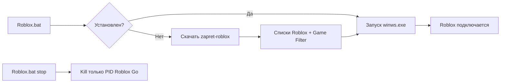

<div align="center">

# Roblox Go

**One-click Roblox launcher for Windows — fixes Error 0 and HTTP connection issues**

[](https://www.microsoft.com/windows)
[](https://learn.microsoft.com/powershell/)
[](LICENSE)

*Install in ~10 seconds. One `.bat` file. No manual zapret setup.*

[Быстрый старт](#-быстрый-старт) · [Команды](#-команды) · [FAQ](#-faq) · [Как это работает](#-как-это-работает)

</div>

---

## Проблема

В РФ и ряде регионов Roblox часто не пускает в игру:

| Симптом | Причина |
|---------|---------|
| **Error 0** | провайдер режет UDP-серверы Roblox |
| **HTTP error** | блокировка TLS / CDN (`clientsettingscdn`, `rbxcdn`) |
| Сайт открывается, плейс — нет | DPI на игровых портах `49152–65535` |

Обычный VPN или смена DNS **не всегда** помогает. Нужен точечный DPI-обход — как в zapret, но **только для Roblox** и **без ручной настройки**.

---

## Решение

**Roblox Go** — лаунчер, который за один клик:

1. Скачивает и настраивает [zapret-roblox](https://github.com/vwercay/zapret-roblox)
2. Подставляет списки доменов и IP Roblox (AS22697)
3. Включает Game Filter + UDP-обход игровых серверов
4. Запускает обход и пишет: *Open Roblox*

> Твой основной zapret (Discord, YouTube) **не трогается**. Остановка убивает только процесс Roblox Go по PID.

---

## Быстрый старт

### 1. Скачай репозиторий

```bash
git clone https://github.com/metan0mia/Roblox-Go.git
```

или **Code → Download ZIP** на GitHub.

### 2. Распакуй в путь без кириллицы

```
C:\Roblox-Go\
```

### 3. Запусти

Правый клик на **`Roblox.bat`** → **Запуск от имени администратора**

Первый запуск сам установит движок (~10 сек). Дальше — только запуск обхода.

### 4. Открой Roblox

Заходи в игру как обычно.

---

## Команды

| Файл | Действие |
|------|----------|
| `Roblox.bat` | Установить (если нужно) + запустить обход |
| `Roblox.bat stop` | Остановить **только** Roblox Go |
| `Roblox.bat fix` | Починить сеть / чёрный экран |
| `Roblox.bat menu` | Интерактивное меню |
| `FixScreen.bat` | То же, что `fix` — сброс DNS и WARP |

---

## Структура проекта

```
Roblox-Go/
├── Roblox.bat          # Главный лаунчер
├── Roblox.ps1          # Логика: install / start / stop / fix
├── FixScreen.bat       # Быстрый фикс дисплея и DNS
├── lists/
│   ├── list-roblox.txt # Домены Roblox + CDN
│   └── ipset-roblox.txt# IP-подсети AS22697
└── installed/          # Создаётся автоматически (в .gitignore)
```

---

## Как это работает



**Что фильтруется:**
- TCP `80/443` — домены из `list-roblox.txt`
- UDP `49152–65535` — игровые серверы по `ipset-roblox.txt`
- DPI-desync стратегии для TLS и UDP

---

## FAQ

<details>
<summary><b>Error 0 всё ещё есть</b></summary>

1. Запусти `Roblox.bat` **от администратора**
2. Дождись `[OK] Bypass started`
3. Запусти `Roblox.bat menu` → пункт **4. Diagnostics**
4. Если `[FAIL] bypass off` — перезапусти `Roblox.bat`
5. Добавь папку в исключения Windows Defender (WinDivert)

</details>

<details>
<summary><b>Чёрный экран при Alt+Tab</b></summary>

1. `Roblox.bat fix` от админа
2. Roblox → **Settings → Graphics → Fullscreen OFF**
3. Не используй Cloudflare WARP вместе с Roblox Go

</details>

<details>
<summary><b>У меня уже запущен zapret для Discord</b></summary>

Если `winws.exe` уже работает — Roblox Go **не запускает второй процесс** и подсказывает настроить Game Filter + ipset any в твоём zapret.

`Roblox.bat stop` **не останавливает** твой основной zapret — только PID из `.roblox.pid`.

</details>

<details>
<summary><b>Антивирус ругается</b></summary>

WinDivert — легитимный драйвер перехвата трафика для DPI-обхода. Добавь папку `Roblox-Go` в исключения или временно отключи защиту при первой установке.

</details>

---

## Требования

- Windows 10 / 11 (x64)
- PowerShell 5.1+
- Права **администратора**
- Интернет для первой установки

---

## Благодарности

- [bol-van/zapret](https://github.com/bol-van/zapret) — DPI bypass engine
- [vwercay/zapret-roblox](https://github.com/vwercay/zapret-roblox) — списки и сборка под Roblox
- [Flowseal/zapret-discord-youtube](https://github.com/Flowseal/zapret-discord-youtube) — оригинальный Windows-бандл

---

## Лицензия

MIT — см. [LICENSE](LICENSE).  
Бинарники WinDivert / winws наследуют лицензии upstream-проектов.

---

<div align="center">

**Если помогло — поставь звезду на GitHub**

Made with care for players who just want to join a game.

</div>
